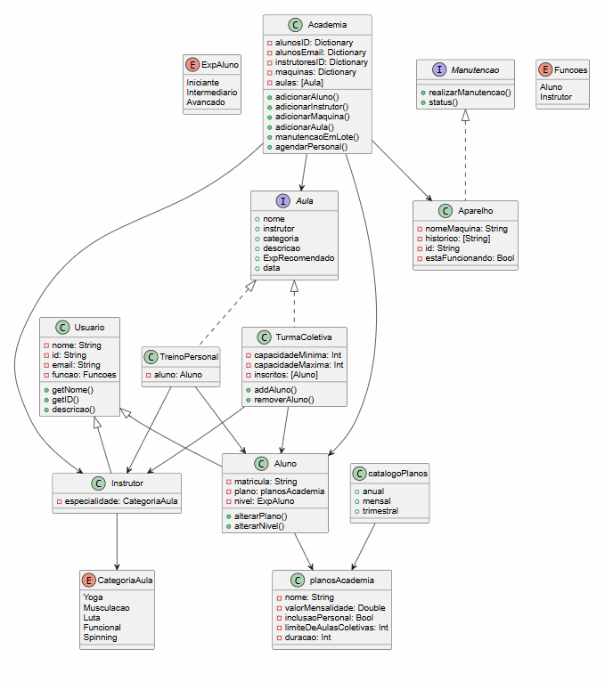

# Sistema de academia em Swift
- O projeto consiste na implementação de um sistema de gerenciamento de academia utilizando Swift.

O sistema é capaz de gerenciar
- Alunos e instrutores
- Planos de academia
- Aulas coletivas e treinos personalizados
- Equipamentos e manutenção
- Validações e restrições

# Projeto
## Dia 1 - Fundações do sistema
Nesta etapa foi realizada a modelagem das entidades centrais e dos tipos básicos necessários para o funcionamento do sistema.

---
### Modelagem de Usuarios
Foram utilizadas classes herdadas de `Usuario` para gerenciar os diferentes tipos de pessoas no sistema.
- `Aluno`: Adiciona o contexto de alunos (como plano de assinatura e nivel de experiencia)
- `Instrutor`: Adiciona o contexto de um instrutor com especialização em tipos de aula
--- 
### Planos de academia
Os planos foram estruturados como uma struct de forma a garantir consistencia e otimização. Eles guardam informações essenciais para os planos de assinatura.
#### `catalogoPlanos` - Estrutura criada para agrupar instancias e padronizar as opções disponiveis
---
### Enums
- Usados para restringir valores validos de Experiencia do aluno, Categoria da aula e Funcao que o Usuario performa.
---
## Dia 2 - Regras de Domínio
Nesta etapa, o sistema define os comportamentos e regras de negócio 
### Protocolos
Criação de contratos de comportamento a serem obedecidos por classes de forma a manter um comportamento padrão mas com mais flexibilidade e desacoplamento
- `Aula`
- `Manutencao`
---
### Modelagem de Aparelhos
A classe `Aparelho` implementa o protocolo `Manutencao`. `Aparelho` deve seguir as regras de implementação
- Registro de histórico de manutenção
- Bloqueio de manutenção em equipamentos quebrados
- Controle de estado

### Modelagem de aulas
O protocolo `Aula` define um contrato comum para os diferentes tipos de aula.

#### Turma coletiva
- Permite multiplos alunos
- Controla a capacidade minima e maxima
- Valida superlotação, Inscrição Duplicada e compatibilidade de nivel do aluno

#### Treino pessoal
- Associação direta entre um aluno e um instrutor
- Representa um agendamento indiviudal
---
## Dia 3 - Gerenciamento central
Nesta etapa foi implementada a classe `Academia`, responsável por centralizar e coordenar todas as operações do sistema.  
`Academia` gerencia entidades, aplica regras globais e garante a consistencia do sistema

---
### Gerenciamento de Usuarios
- Não permite duplicação de alunos (por ID ou email)
- Não permite duplicação de instrutores
---
### Gerenciamento de equipamentos
- Registro de maquinas
- Manutenção individual
- Manutenção em lote
---
### Agendamento de treino com personal
- Regras:
    - Aluno deve possuir plano com personal
    - Instrutor não pode ter conflito de horário

---
## Diagrama de classe
